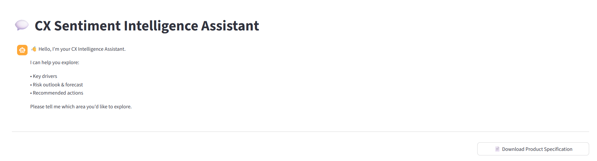

# CX Sentiment Intelligence Assistant

AI-powered conversational assistant for analysing customer sentiment and generating executive CX insights.

## Problem
Customer feedback across ecommerce, social media, surveys, and support channels is fragmented and difficult for leadership teams to interpret.

## Solution
This prototype demonstrates an AI-powered CX intelligence system that:

• Detects key drivers of sentiment  
• Forecasts emerging CX risk  
• Recommends leadership actions  
• Provides conversational executive insights

## Architecture
Inspired by Microsoft Azure AI reference architecture.

Stack includes:

- Azure AI Language (conceptual)
- Azure OpenAI (simulated via Groq)
- Azure Data Lake
- Power BI
- Streamlit UI

## Features

✔ Conversational CX assistant  
✔ Sentiment insight retrieval  
✔ Executive recommendation generation  
✔ Forecast integration  
✔ Product specification export

## Demo

Run locally:
## Demo Interface

